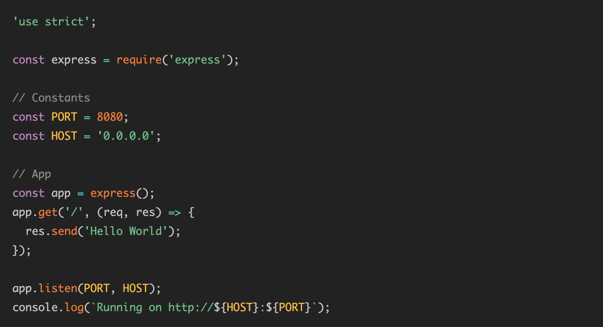
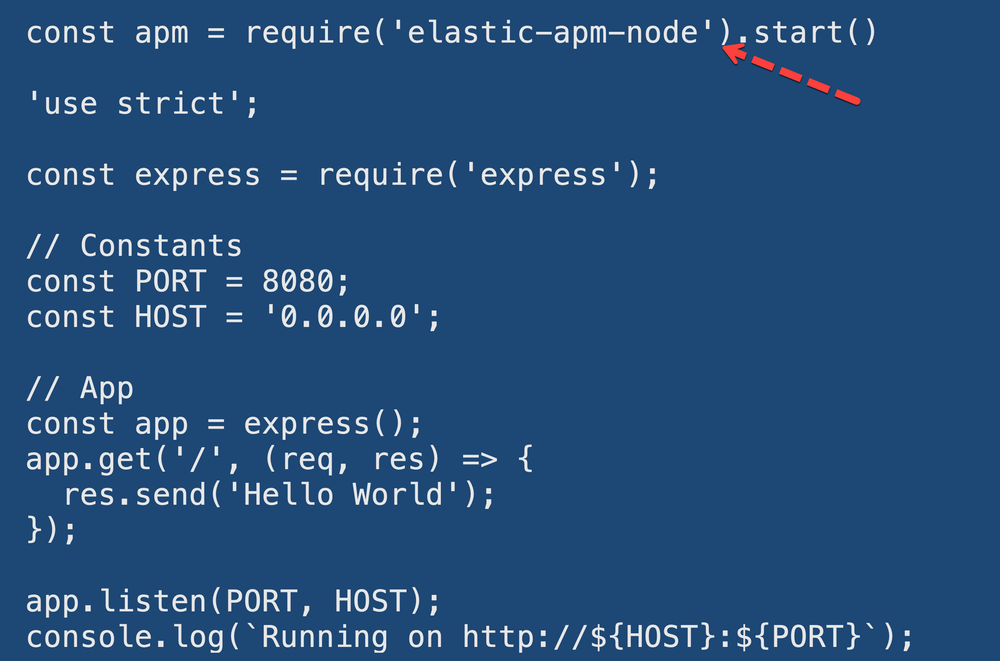
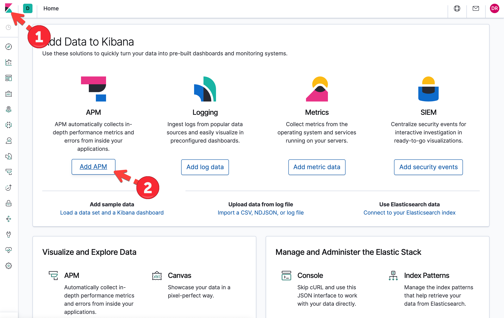
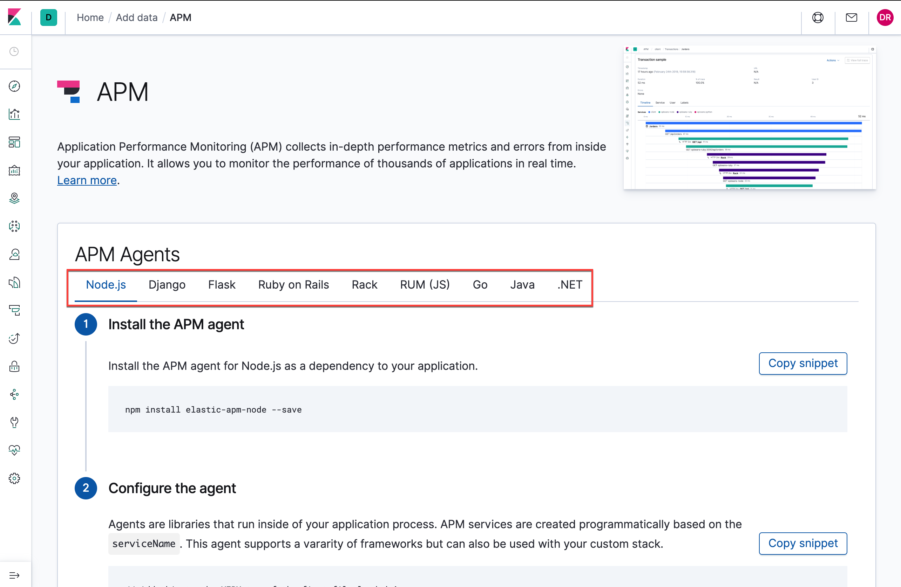
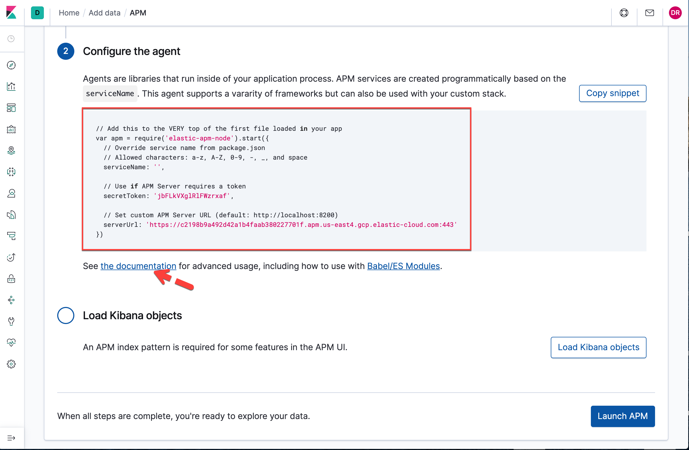
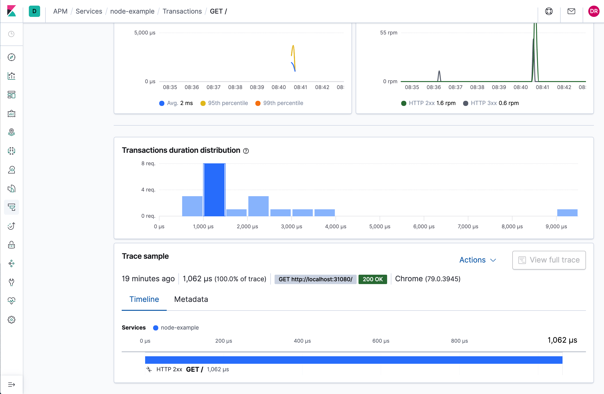

# Elastic APM: Instrument a Node.js Express app running in Kubernetes

This is a very simple example, and is meant to show the method of including the Elastic APM Agent for Node.js in your application.  The application is a very basic getting started example, and does not involve any external datastore or other services, but it does illustrate the method for including the APM details in a Node.js app running in Kubernetes.

For this example I took the [Dockerizing a Node.js web app](https://nodejs.org/en/docs/guides/nodejs-docker-webapp/) guide and added one line to the sample code:
```
const apm = require('elastic-apm-node').start()
```

Here is the original code:


and here is the modified code:


Follow the instructions in the [Node.js Guide](https://nodejs.org/en/docs/guides/nodejs-docker-webapp/), and once you have the code working in a Docker container then open Kibana and follow these instructions to instrument your application with Elastic APM.

## Get the APM details for your Elastic deployment
Follow the instructions in Kibana Home -> Add APM, with a Kubernetes twist, as 
instead of adding the APM details to the `.js` file pass in Kubernetes secrets.




In this example, the code is Node.js, so select Node.js, and run the `npm install elastic-apm-node --save` as shown:


The next block shows the APM details for your Elasticsearch Service in Elastic Cloud.  Since this is a Kubernetes example, use a Kubernetes Secret rather than adding the details to your `.js` file.  There are three details needed:

 - serviceName
 - secretToken
 - serverUrl

These variables are described in the [advanced docs](https://www.elastic.co/guide/en/apm/agent/nodejs/3.x/express.html#express-advanced-configuration).  The docs are written for an environment where the variables would be set in the environment, and because this is a Kubernetes deployment use Kubernetes secrets to set them.



Copy the `serverUrl` and `secretToken`, and decide what the `serviceName` should be set to for your service.  You will use these in the next step.

## Configure Kubernetes

### Create a namespace for the app
```
kubectl create -f namespace.yaml
```

### Add a Kubernetes secret
Copy each of these out of Kibana and use them to create a secret named apm-details as shown below (use your details):

```
echo -n 'jbFLkVXglRlFWzrxaf' > ELASTIC_APM_SECRET_TOKEN

echo -n 'https://c2198b9a492d42a1b4faab380227701f.apm.us-east4.gcp.elastic-cloud.com:443' > ELASTIC_APM_SERVER_URL

echo -n 'node-example' > ELASTIC_APM_SERVICE_NAME

kubectl create secret generic apm-details \
  --from-file=./ELASTIC_APM_SECRET_TOKEN \
  --from-file=./ELASTIC_APM_SERVER_URL \
  --from-file=./ELASTIC_APM_SERVICE_NAME \
  --namespace=express-demo
```

## Update your Docker image and push to Docker Hub
Because you added the Elastic APM agent rebuild your Docker image (just like you did earlier) and push to Docker Hub or your own repository.

## Deploy the application

Substitute your Docker image in the provided `node-express.yaml` file and run these commands.  You may need to edit the Service to expose an open port on your system or to use something other than a NodePort:

```
kubectl create -f node-express.yaml 

kubectl get pods -n express-demo
```

Check the logs for the pod returned above.

### Generate traffic

The below commands are written for the port exposed in the sample `node-express.yaml`, if you exposed the deployment in a different manner adjust the commands.

```
curl http://localhost:31080
curl http://localhost:31080/foo
```

## View APM:


